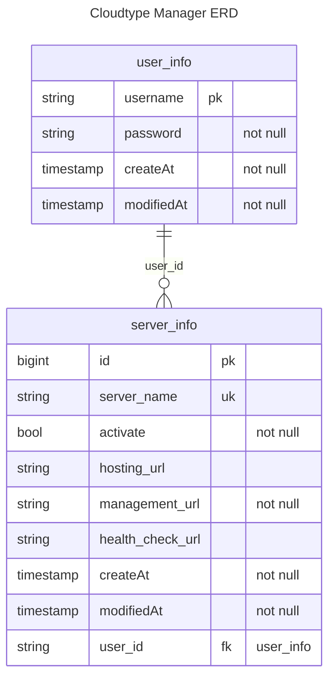

# cloudtype-manager
CloudType PaaS 플랫폼과 같은 프리티어 클라우드 서버에 대한 통합 관리 대시보드

---
> 개인 프로젝트를 통해 구성된 서버들의 활성 상태 관리 모듈

# 요구 사항
개인 프로젝트들을 진행하면서 무료 호스팅 서버에 배포 되었던 서버들에 대한 활성 상태 조회 및 관련 정보들을 한 번에 취합해서 볼 수 있는 대시보드에 대한 필요성에 의해 진행됨
- [CloudType]()과 같은 무료 `PaaS` 플랫폼의 경우, 일정 시간 이후 자동으로 서버가 종료되기 때문에, 매번 종료된 인스턴스를 다시 재시작 해야 하는 이슈가 존재함
- 또한, 본인의 경우 여러 계정으로 여러 무료 서버를 띄워서 사용하기 때문에 각 서버들을 한 눈에 볼 수 있는 화면이 필요함

## 주요 기능
1. **관리할 서버 정보 등록**
    - 서버 host URL 및 관리 화면 접근 URL들이 포함된 데이터를 저장하여 관리하도록 함
2. **관리 서버 목록 조회**
    - 현재 등록된 서버들에 대한 기본 정보가 포함된 목록을 조회할 수 있어야 함
3. **관리 서버 별 상세 정보 조회**
    - 현재 관리 중인 서버에 대한 활성 상태, host URL 및 관리자 페이지 접근 등이 가능한 정보를 조회 할 수 있어야 함
4. **서버 비활성화 시 알림 발송**
    - 관리 중인 서버가 비활성 상태로 변경되거나 문제가 발생 했을 경우, 메신저나 푸시 알림 등이 사용자에게 전달되야 함
# 화면 시안
[와이어프레임](https://www.figma.com/design/H3MpuwmQq9ec6APXQb61ZL/cloudtype-manager-ui?node-id=0-1&t=zjgYBRzmXmSdYJew-0)

# ERD
