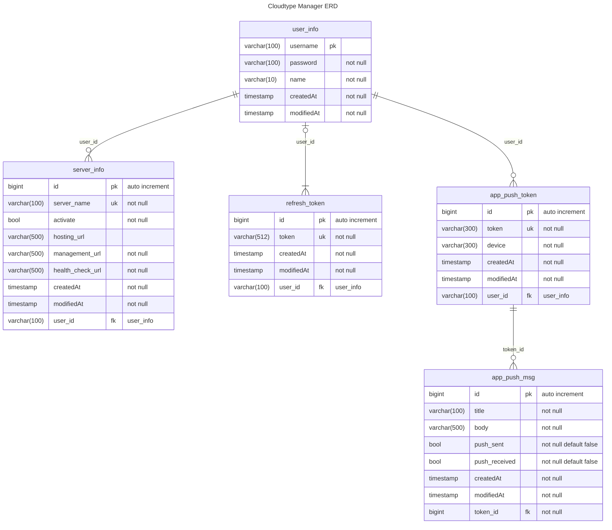

# Cloudtype Manager API 모듈

---

# 환경 구성

## 실행환경

- `jdk 17`
- `gradle`
- `spring-boot`

## 환경 변수

```json
{
  "DATABASE_URL": "DB JDBC URL",
  "DATABASE_USERNAME": "DB username",
  "DATABASE_PASSWORD": "DB password",
  "ALLOWED_ORIGIN_SERVER_URL": "UI 모듈 URL"
}
```

## ERD

